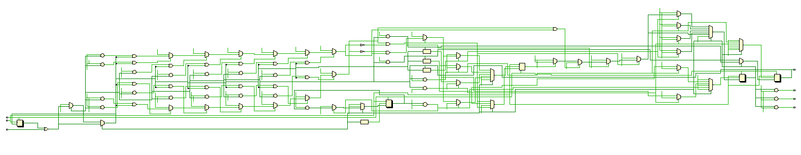
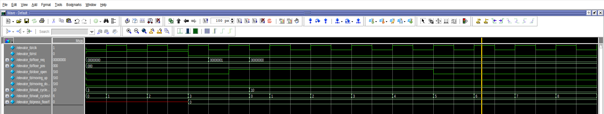
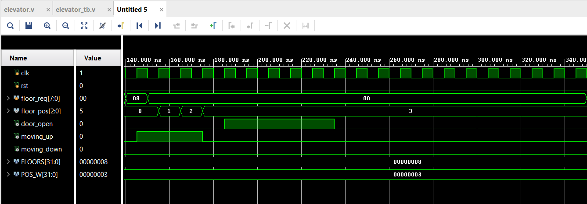
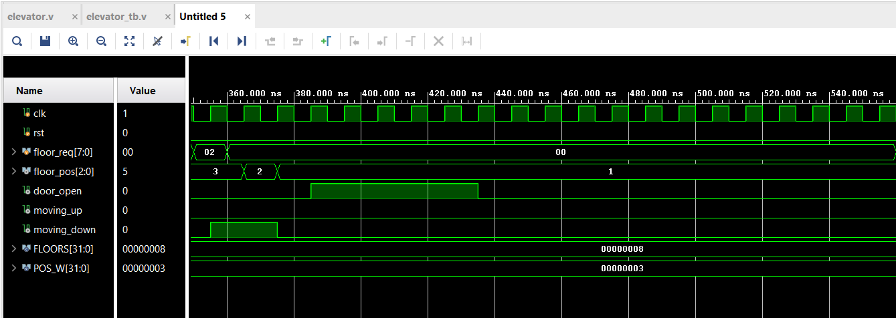
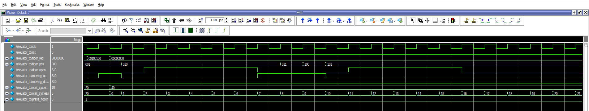

# Simulation Report – Elevator Controller

## 1. Purpose

This report documents the **RTL simulation results** of the Elevator Controller module.  
The objective is to verify the correctness of the FSM behavior using waveform analysis.

---

## 2. RTL Schematic (Reference)

The synthesized RTL schematic is provided for reference only.
Functional correctness of the design is validated through
RTL simulation and waveform analysis.

---

## 3. Simulation Test Cases

Four representative test cases were simulated to validate the functionality of the design.

---

### Case 1 – Request at Current Floor

**Description:**  
A floor request is issued at the same floor where the elevator is currently located.

**Expected Behavior:**
- No movement
- Door opens immediately

**Waveform:**

**Result:**  
The elevator correctly detects the request and opens the door without changing the floor position.

---

### Case 2 – Upward Movement

**Description:**  
A request is issued for a higher floor.

**Expected Behavior:**
- Elevator moves upward one floor per clock cycle
- Door opens at the target floor

**Waveform:**

**Result:**  
The simulation shows correct upward movement with proper door operation at the destination.

---

### Case 3 – Downward Movement

**Description:**  
A request is issued for a lower floor.

**Expected Behavior:**
- Elevator moves downward
- Door opens upon arrival

**Waveform:**

**Result:**  
The elevator transitions correctly to downward movement and opens the door at the requested floor.

---

### Case 4 – Multiple Floor Requests

**Description:**  
Multiple floor requests are issued simultaneously.

**Expected Behavior:**
- All requests are stored
- Elevator services each request sequentially

**Waveform:**

**Result:**  
The simulation confirms that no requests are lost and all floors are serviced correctly.

---

## 4. Conclusion

The simulation results confirm that the elevator controller FSM operates as intended.  
All tested scenarios show correct floor handling, direction control, and door operation.